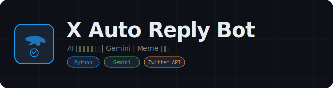

<div align="center">
  

  # X Auto Reply Bot

  **AI 驱动的 Twitter 自动回复机器人**

  [](https://python.org)
  [](https://openrouter.ai)
  []()
  [](LICENSE)
</div>

---

## 项目概述

X Auto Reply Bot 是一个基于 Gemini AI 模型的 Twitter 自动回复机器人。通过 APIDance 代理服务实时轮询 Twitter 通知接口，检测新的 @提及消息，使用 OpenRouter API 调用 Gemini 2.0 Flash Lite 模型生成个性化英文回复，并自动发送回复推文。系统内置中文检测和重试机制确保回复质量，支持 Meme 图片生成（基于用户头像），使用 Loguru 进行完整的多级日志记录。

## 技术栈

- **Python**: 核心编程语言
- **OpenRouter API**: AI 模型网关（Gemini 2.0 Flash Lite）
- **APIDance**: Twitter API 代理服务（REST + GraphQL）
- **Loguru**: 结构化日志系统（文件 + 控制台，自动轮转）
- **requests**: HTTP 请求客户端
- **requests-toolbelt**: Multipart 文件上传
- **JSON**: 数据持久化（推文 ID、头像缓存）

## 功能特性

- **AI 智能回复** -- 使用 Gemini 2.0 Flash Lite 模型生成英文回复，Prompt 模板可自定义风格和语气
- **实时通知监听** -- 每 2 秒轮询 Twitter 通知接口，自动检测新的 @提及消息
- **智能内容分析** -- 区分空提及（仅 @用户名）和有内容提及，空提及使用预设回复，有内容提及调用 AI
- **中文检测过滤** -- 自动检测 AI 回复中的中文字符和中文标点，触发重试确保纯英文输出
- **自动重试机制** -- AI API 调用失败或回复不合格时自动重试（最多 3 次），每次重试增加温度参数
- **备选回复库** -- 重试耗尽后从 6 条预设备选回复中随机选取，保证服务连续性
- **Meme 图片生成** -- 自动下载用户头像，支持 petpet、clown_mask、gun、bubble_tea 等 15+ 种 Meme 模板
- **头像缓存** -- 缓存已下载的头像和已生成的 Meme，避免重复处理
- **推文 ID 追踪** -- 持久化记录最后处理的推文 ID，重启后不会重复回复
- **完整日志系统** -- Loguru 多级日志（TRACE/DEBUG/INFO），文件自动轮转（1MB），保留 24 小时
- **标准输出拦截** -- 将 stdout/stderr 重定向到 Loguru，统一日志管理

## 安装说明

1. 克隆仓库到本地：
   ```bash
   git clone https://github.com/Past-Tang/x-auto-reply-bot.git
   cd x-auto-reply-bot
   ```

2. 安装依赖：
   ```bash
   pip install -r src/requirements.txt
   ```

3. 配置参数（编辑 `src/config.py`）：
   ```python
   # APIDance Twitter API 代理
   XAPIENDPOINT = 'https://api.apidance.pro'
   APIKEY = 'your_apidance_api_key'
   AUTHTOKEN = 'your_twitter_auth_token'

   # Twitter 用户名（机器人账号）
   USERNAME = 'your_twitter_username'

   # OpenRouter AI API
   AI_API_URL = "https://openrouter.ai/api/v1/chat/completions"
   AI_API_TOKEN = "your_openrouter_api_token"
   ```

## 使用方法

1. 启动机器人：
   ```bash
   cd src
   python main.py
   ```

2. 机器人启动后会：
   - 每 2 秒轮询 Twitter 通知
   - 检测到新的 @提及后自动生成 AI 回复
   - 发送回复推文并记录日志

3. 按 `Ctrl+C` 停止运行

## 配置说明

### AI 模型参数 (`config.py`)

| 参数 | 默认值 | 说明 |
|:---|:---|:---|
| `AI_MODEL` | `google/gemini-2.0-flash-lite-001` | AI 模型名称 |
| `AI_MAX_TOKENS` | `1024` | 最大生成 Token 数 |
| `AI_TEMPERATURE` | `0.85` | 生成温度（每次重试 +0.1） |
| `AI_TOP_P` | `0.85` | Top-P 采样 |
| `AI_MIN_P` | `0.03` | Min-P 采样 |
| `AI_TOP_K` | `60` | Top-K 采样 |
| `AI_FREQUENCY_PENALTY` | `0.7` | 频率惩罚 |
| `SLEEPTIME` | `2` | 轮询间隔（秒） |

### Prompt 模板

系统内置英文攻击性风格 Prompt，要求 AI 生成简短、讽刺、直接的回复。可在 `config.py` 中修改 `PROMPT_TEMPLATE` 自定义风格。

## 项目结构

```
x-auto-reply-bot/
├── src/
│   ├── main.py             # 主程序（412行）：通知轮询、AI 回复、Meme 生成
│   ├── config.py           # 配置文件：API 密钥、AI 参数、Prompt 模板
│   ├── twitterApi.py       # Twitter API 封装（144行）：通知、发推、搜索、用户信息
│   ├── memeFactory.py      # Meme 图片生成器
│   ├── upload_file.py      # 文件上传（49行）：Multipart 上传到 APIDance
│   └── requirements.txt    # Python 依赖
├── save/
│   ├── basic.json          # 持久化数据（lastTweetId）
│   └── avatar.json         # 头像缓存数据
├── logs/                   # 日志输出目录（运行时生成）
│   ├── main.log            # TRACE 级别完整日志
│   └── console.log         # DEBUG 级别日志
├── assets/
│   └── logo.svg            # 项目 Logo
├── LICENSE                 # MIT 许可证
└── README.md
```

## 核心流程

```
启动 -> 加载持久化数据（lastTweetId、头像缓存）
     -> 轮询循环（每 2 秒）:
        ├── 调用 /2/notifications/all.json 获取通知
        ├── 筛选 ID > lastTweetId 的新推文
        ├── 对每条新推文:
        │   ├── 检查是否 @提及了机器人
        │   ├── 空提及 -> 使用预设回复
        │   ├── 有内容提及 -> 调用 AI 生成回复
        │   │   ├── 检测中文 -> 重试（最多 3 次）
        │   │   └── 重试耗尽 -> 使用备选回复
        │   ├── 调用 CreateTweet GraphQL 发送回复
        │   └── 更新 lastTweetId
        └── 保存持久化数据
```

## Meme 模板

| 模板名称 | 输出格式 | 说明 |
|:---|:---|:---|
| petpet | GIF | 摸头动画 |
| clown_mask | PNG | 小丑面具（前/后） |
| gun | PNG | 持枪（前/后） |
| bubble_tea | PNG | 奶茶（左/右/双手） |
| kaleidoscope | PNG | 万花筒效果 |
| mourning | PNG | 哀悼效果 |
| pixelate | PNG | 像素化（随机程度） |
| read_book | PNG | 读书（自定义文字） |
| symmetric | PNG | 对称效果（四方向） |
| 其他 | PNG | charpic、jerry_stare、potato 等 |

## 依赖项

| 包 | 版本 | 用途 |
|:---|:---|:---|
| requests | >=2.25.1 | HTTP 请求 |
| loguru | >=0.5.3 | 结构化日志 |
| requests-toolbelt | >=0.9.1 | Multipart 文件上传 |

## 常见问题

### API 返回数据结构异常？
APIDance 代理服务可能返回非标准格式，系统已内置 KeyError 异常处理，会记录错误并继续运行。

### AI 回复总是中文？
系统内置中文检测和重试机制。如果仍然出现中文，检查 `config.py` 中的 `PROMPT_TEMPLATE` 是否明确要求英文输出。

### 如何修改回复风格？
编辑 `config.py` 中的 `PROMPT_TEMPLATE`，修改 AI 的角色设定和回复要求。

### 日志文件在哪里？
日志保存在 `src/logs/` 目录下，`main.log` 包含 TRACE 级别完整日志，`console.log` 包含 DEBUG 级别日志。

## 安全注意事项

- APIDance API Key 和 Auth Token 存储在 `config.py` 中，请勿提交到公开仓库
- OpenRouter API Token 同样需要保密
- 建议将敏感配置迁移到环境变量或 `.env` 文件
- 机器人账号可能因自动回复行为被 Twitter 限制，请合理设置轮询间隔

## 许可证

[MIT License](LICENSE)

## 免责声明

本工具仅供学习研究使用，请遵守 Twitter 平台规则和服务条款。自动回复机器人可能违反平台自动化政策，使用者需自行承担所有风险。